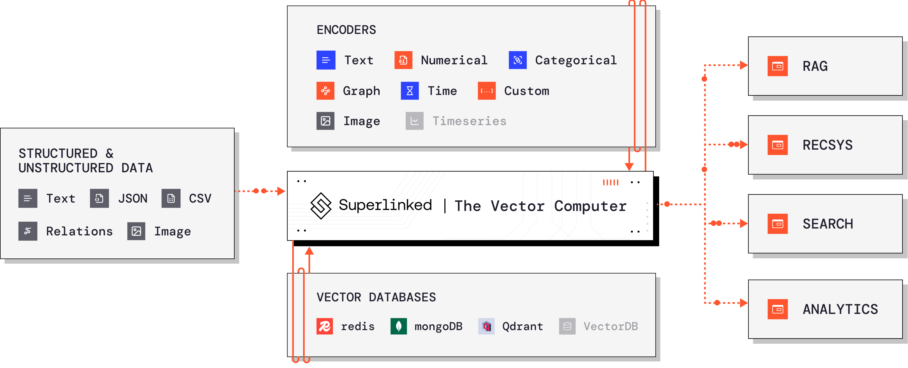

<div align="center">
<picture>
  <source
    srcset="https://cdn.prod.website-files.com/65dce6831bf9f730421e2915/66ef0317ed8616151ee1d451_superlinked_logo_white.png"
    media="(prefers-color-scheme: dark)"
  />
  <source
    srcset="https://cdn.prod.website-files.com/65dce6831bf9f730421e2915/65dce6831bf9f730421e2929_superlinked_logo.svg"
    media="(prefers-color-scheme: light), (prefers-color-scheme: no-preference)"
  />
  
</picture>

</div>  &nbsp;


<div align="center">

<p align="center">
  <a href="https://links.superlinked.com/deep_wiki_repo">
    
  </a>
</p>


[![Documentation](https://img.shields.io/badge/Documentation-orange?logo=)](https://docs.superlinked.com/)
[](https://deepwiki.com/superlinked/superlinked)
[](https://pypi.org/project/superlinked/)

 


</div>

<p align="center">
  <em>Superlinked is a Python framework for AI Engineers building <b>high-performance search & recommendation applications</b> that combine <b>structured</b> and <b>unstructured</b> data. <a href="https://docs.superlinked.com">Check documentation</a> to get started.</em>
</p>

## Table of Contents

- [Table of Contents](#table-of-contents)
- [Overview](#overview)
- [Features](#features)
- [Use-cases](#use-cases)
- [Experiment in a notebook](#experiment-in-a-notebook)
    - [Install the superlinked library](#install-the-superlinked-library)
    - [Run the example:](#run-the-example)
- [Run in production](#run-in-production)
  - [Supported Vector Databases](#supported-vector-databases)
- [Logging](#logging)
- [Resources](#resources)
- [Support](#support)

## Overview

- **WHY**: Improve your vector search relevance by encoding metadata together with your unstructured data into vectors.
- **WHAT**: A framework and a self-hostable REST API server that connects your data, vector database and backend services.
- **HOW**: Construct custom data & query embedding models from pre-trained encoders from `sentence-transformers`, `open-clip` and custom encoders for numbers, timestamps and categorical data. See the [feature](#features) and [use-case](#use-cases) notebooks below for examples.

If you like what we do, give us a star! ⭐



---

## Features

- Embed structured and unstructured data ([Text](https://colab.research.google.com/github/superlinked/superlinked/blob/main/notebook/feature/text_embedding.ipynb) | [Image](https://colab.research.google.com/github/superlinked/superlinked/blob/main/notebook/feature/image_embedding.ipynb) | [Number](https://colab.research.google.com/github/superlinked/superlinked/blob/main/notebook/feature/number_embedding_minmax.ipynb) | [Category](https://colab.research.google.com/github/superlinked/superlinked/blob/main/notebook/feature/categorical_embedding.ipynb) | [Time](https://colab.research.google.com/github/superlinked/superlinked/blob/main/notebook/feature/recency_embedding.ipynb) | [Event](https://colab.research.google.com/github/superlinked/superlinked/blob/main/notebook/feature/event_effects.ipynb))
- Combine encoders to build a custom model ([notebook](https://colab.research.google.com/github/superlinked/superlinked/blob/main/notebook/feature/combine_multiple_embeddings.ipynb))
- Add a custom encoder ([notebook](https://colab.research.google.com/github/superlinked/superlinked/blob/main/notebook/feature/custom_space.ipynb))
- Update your vectors with behavioral events & relationships ([notebook](https://colab.research.google.com/github/superlinked/superlinked/blob/main/notebook/feature/event_effects.ipynb))
- Use query-time weights ([notebook](https://colab.research.google.com/github/superlinked/superlinked/blob/main/notebook/feature/query_time_weights.ipynb))
- Query with natural language ([notebook](https://colab.research.google.com/github/superlinked/superlinked/blob/main/notebook/feature/natural_language_querying.ipynb))
- Filter your results ([notebook](https://colab.research.google.com/github/superlinked/superlinked/blob/main/notebook/feature/hard_filtering.ipynb))
- Export vectors for analysis ([notebook](https://colab.research.google.com/github/superlinked/superlinked/blob/main/notebook/feature/vector_sampler.ipynb))
- Embed text or images into a multi-modal vector space ([notebook](https://colab.research.google.com/github/superlinked/superlinked/blob/main/notebook/feature/image_embedding.ipynb))

You can check a full list of our [features and concepts](https://docs.superlinked.com/concepts/overview).

## Use-cases

Dive deeper with our notebooks into how each use-case benefits from the Superlinked framework.

- **RAG**: [HR Knowledgebase](https://colab.research.google.com/github/superlinked/superlinked/blob/main/notebook/rag_hr_knowledgebase.ipynb)
- **Semantic Search**: [Movies](https://colab.research.google.com/github/superlinked/superlinked/blob/main/notebook/semantic_search_netflix_titles.ipynb), [Business News](https://colab.research.google.com/github/superlinked/superlinked/blob/main/notebook/semantic_search_news.ipynb), [Product Images & Descriptions](https://colab.research.google.com/github/superlinked/superlinked/blob/main/notebook/image_search_e_commerce.ipynb)
- **Recommendation Systems**: [E-commerce](https://colab.research.google.com/github/superlinked/superlinked/blob/main/notebook/recommendations_e_commerce.ipynb)
- **Analytics**: [User Acquisition](https://colab.research.google.com/github/superlinked/superlinked/blob/main/notebook/analytics_user_acquisition.ipynb), [Keyword expansion](https://colab.research.google.com/github/superlinked/superlinked/blob/main/notebook/analytics_keyword_expansion_ads.ipynb)

You can check a full list of examples [here](https://github.com/superlinked/superlinked/tree/main/notebook).

## Experiment in a notebook

Let's build an e-commerce product search that understands product descriptions and ratings:

#### Install the superlinked library
```
%pip install superlinked
```

#### Run the example:

>First run will take a minute to download the embedding model.  

```python
import json
import os

from superlinked import framework as sl


class Product(sl.Schema):
    id: sl.IdField
    description: sl.String
    rating: sl.Integer


product = Product()

description_space = sl.TextSimilaritySpace(
    text=product.description, model="Alibaba-NLP/gte-large-en-v1.5"
)
rating_space = sl.NumberSpace(
    number=product.rating, min_value=1, max_value=5, mode=sl.Mode.MAXIMUM
)
index = sl.Index([description_space, rating_space], fields=[product.rating])


# Define your query and parameters to set them directly at query-time
# or let an LLM fill them in for you using the `natural_language_query` param.
# Don't forget to set your OpenAI API key to unlock this feature.
query = (
    sl.Query(
        index,
        weights={
            description_space: sl.Param("description_weight"),
            rating_space: sl.Param("rating_weight"),
        },
    )
    .find(product)
    .similar(
        description_space,
        sl.Param(
            "description_query",
            description="The text in the user's query that refers to product descriptions.",
        ),
    )
    .limit(sl.Param("limit"))
    .with_natural_query(
        sl.Param("natural_language_query"),
        sl.OpenAIClientConfig(api_key=os.environ["OPEN_AI_API_KEY"], model="gpt-4o")
    )
)

# Run the app in-memory (server & Apache Spark executors available too!).
source = sl.InMemorySource(product)
executor = sl.InMemoryExecutor(sources=[source], indices=[index])
app = executor.run()


# Ingest data into the system - index updates and other processing happens automatically.
source.put([
    {
        "id": 1,
        "description": "Budget toothbrush in black color. Just what you need.",
        "rating": 1,
    },
    {
        "id": 2,
        "description": "High-end toothbrush created with no compromises.",
        "rating": 5,
    },
    {
        "id": 3,
        "description": "A toothbrush created for the smart 21st century man.",
        "rating": 3,
    },
])

result = app.query(query, natural_query="best toothbrushes", limit=1)

# Examine the extracted parameters from your query
print(json.dumps(result.metadata, indent=2))

# The result is the 5-star rated product.
sl.PandasConverter.to_pandas(result)
```

## Run in production

With a single command you can run Superlinked as a REST API Server locally or in your cloud with [Superlinked Server](https://pypi.org/project/superlinked-server). Get data ingestion and query APIs, embedding model inference and deep vector database integrations for free!

Unify your evaluation, ingestion and serving stacks with a single declarative python codebase. Superlinked enables this by letting you define your data schema, vector indexes and the compute DAG that links them all at once and then choose the right executor for the task - in-memory or server.

If you are interested in learning more about running at scale, [Book a demo](https://links.superlinked.com/sl-repo-readme-form) for early access to our managed cloud.

### Supported Vector Databases

Superlinked stores *your vectors* in *your vector database*, with deep integrations for:

- [Redis](https://docs.superlinked.com/run-in-production/index-1/redis)
- [MongoDB](https://docs.superlinked.com/run-in-production/index-1/mongodb)
- [Qdrant](https://docs.superlinked.com/run-in-production/index-1/qdrant)
- [Which one should we support next?](https://github.com/superlinked/superlinked/discussions/41)

Curious about vector database pros & cons in general? Our community [compared 44 Vector Databases on 30+ features](https://superlinked.com/vector-db-comparison/).

## Logging

The Superlinked framework logs include contextual information, such as the process ID and package scope. Personally Identifiable Information (PII) is filtered out by default but can be exposed with the `SUPERLINKED_EXPOSE_PII` environment variable to `true`.

## Resources

- [Vector DB Comparison](https://superlinked.com/vector-db-comparison/): Open-source collaborative comparison of vector databases by Superlinked.
- [VectorHub](https://superlinked.com/vectorhub/): VectorHub is a free and open-sourced learning hub for people interested in adding vector retrieval to their ML stack

## Support

Need help? We're here to support you:
- Report a bug by creating an [issue](https://github.com/superlinked/superlinked/issues/new?assignees=kembala&labels=bug&projects=&template=bug_report.md&title=)
- Request a new feature [here](https://github.com/superlinked/superlinked/issues/new?assignees=kembala&labels=enhancement&projects=&template=feature_request.md&title=)
- Start a [discussion](https://github.com/superlinked/superlinked/discussions/new/choose) about your ideas or questions

Please create separate issues/discussions for each topic to help us better address your feedback. Thank you for contributing!
